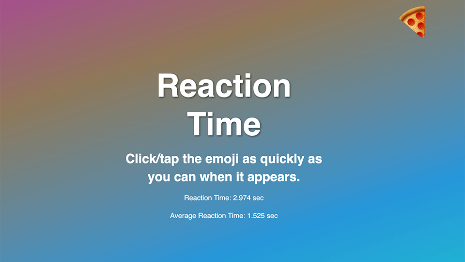

# Reaction Time

🤖 AI-Assited (Gemini 1.5 Pro)

The "Reaction Time" project is a web-based application that measures a user's reaction time using JavaScript, HTML, and CSS. It involves basic web development techniques such as event handling and timing functions to provide an interactive experience where users can test and improve their response speed.

## Site
* 👉 [github.com/jsohndata/reaction-time](https://github.com/jsohndata/reaction-time)
